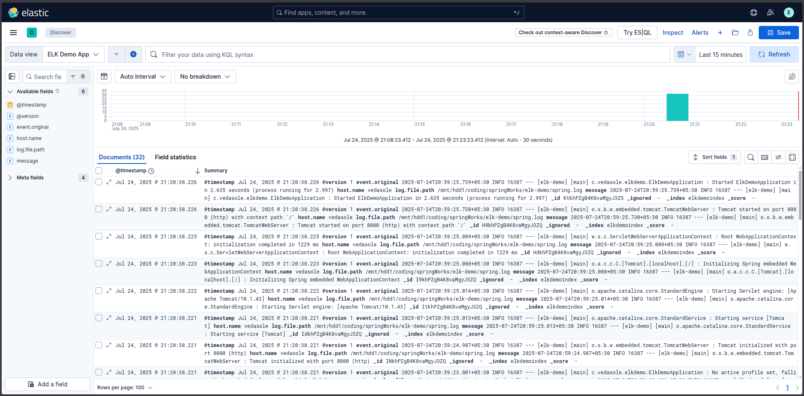
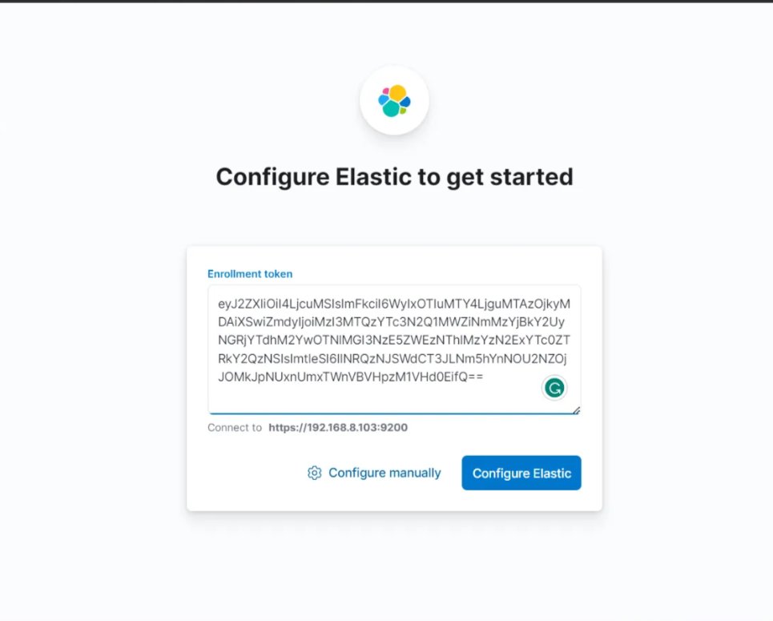
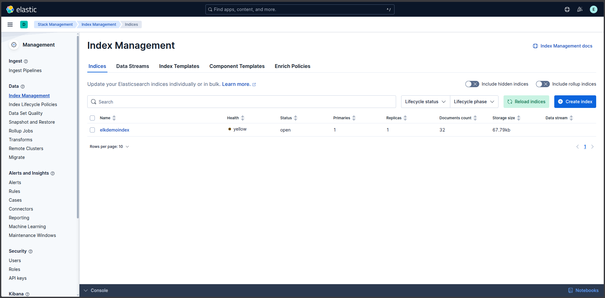
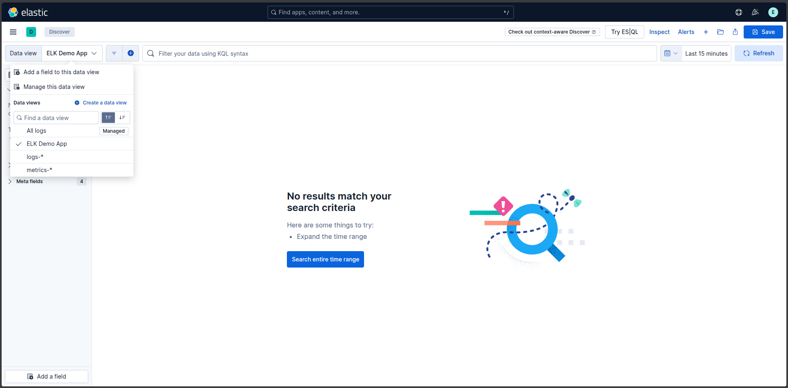
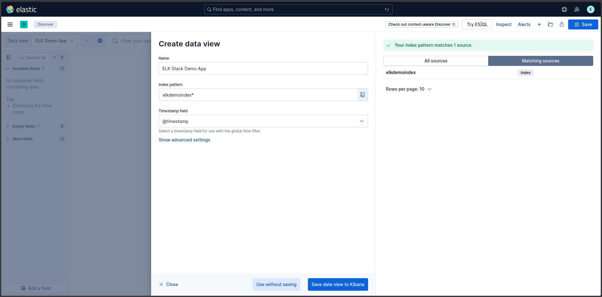

# Spring Boot + ELK Stack Demo Project

# Demo Link: 🔗
Access the site at **[localhost:8080](https://localhost:8080)**

# Table of Content: 📑

- [About The App](#about-the-app)
- [Screenshots](#screenshots)
- [Technologies](#technologies)
- [Setup](#setup)
- [Approach](#approach)
- [Status](#status)

# About the App: 📚
A demo project to test out the integration of Spring Boot with the ELK stack (Elasticsearch, Logstash, and Kibana).

# Screenshots: 📷

### 1) Kibana Logs:


# Technologies: ☕️  ⚛️

- Java
- Spring Boot
- Spring Web
- Elasticsearch
- Logstash
- Kibana

# Setup: 💻

### 1) Set up ElasticSearch

To install and run ElasticSearch follow th given steps:

1. [Download](https://www.elastic.co/downloads/elasticsearch) and unzip Elasticsearch. <br>
Go to the `bin` directory inside the folder where you unzipped Elasticsearch.
<br><br>
2. Open Terminal and navigate to the above-mentioned directory then execute the following command.
    ```bash
   bash ./elasticsearch
   ```

3. Review the logs in terminal and copy the following values and save them.

    `1. Password for the elastic user` <br>
    `2. Enrollment token`

    `````
    To Generate a new enrollment key
    1. Go to elasticsearch-<version>-<os>-<system-type>\elasticsearch-<version>\bin
    2. Run elasticsearch-create-enrollment-token.bat - url https://localhost:9200 -s kibana
    
    To Reset the elastic user password
    1. Go to elasticsearch-<version>-<os>-<system-type>\elasticsearch-<version>\bin
    2. Run elasticsearch-reset-password.bat -u elastic`
    `````

4. To check the status of the Elasticsearch cluster connection, hit https://localhost:9200/ on your browser and provide the Username as “elastic” and use the password you saved in step #3.

If your cluster is working properly you should get the below output.


### 2) Set up Kibana

To install and run Kibana follow the given steps:

1. [Download](https://www.elastic.co/downloads/kibana) and unzip Kibana. <br>
Go to the `bin` directory inside the folder where you unzipped Kibana.
<br><br>
2. Open Terminal and navigate to the above-mentioned directory then execute the following command.
    ```bash
   bash ./kibana
   ```
3. Open your browser and go to https://localhost:5601/ and provide the Enrollment token saved in “Set up Elasticsearch” you saved in step #3 of Elasticsearch setup.
 <br><br>

4. Click Configure Elastic.


### 3) Set up Logstash

To install and run Logstash follow the given steps:

1. [Download](https://www.elastic.co/downloads/logstash) and unzip Logstash. Go to the directory where you unzipped Logstash.
<br><br>

2. Create a new file named `logstash.conf` in the `config` directory of Logstash and add the following configuration:

    ```plaintext

    input {
      file {
        path => "/path/to/your/spring.log"
        start_position => "beginning"
      }
    }
    
    output {
      stdout {
        codec => rubydebug
      }
      elasticsearch {
        hosts => ["https://localhost:9200"]
        ssl_verification_mode => none
        ssl_enabled => true
        index => "elkdemoindex"
        user => "elastic"
        password => "<Elastic Search Password>"
      }
    }
    ```

   Replace `/path/to/your/spring.log` with the actual path to your Spring Boot log file and `<Elastic Search Password>` with the password you saved in the Elasticsearch setup step #3.
    <br><br>

3. Open Terminal and navigate to the `bin` directory of Logstash and execute the following command:

    ```bash
    bash ./logstash -f ./config/logstash.conf
    ```

### 4) Verify the ELK + Spring boot Flow
After setting up Elasticsearch, Kibana, and Logstash, you can verify the flow by running your Spring Boot application. The application will generate logs in the `spring.log` file, which Logstash will read and send to Elasticsearch.

1. Start your Spring Boot application. You can do this by running the main class of your Spring Boot application, which will generate logs in the `spring.log` file.
2. Check the Logstash to Spring boot Integration: <br>
   Open the terminal where Logstash is running. You should see logs being processed in JSON format and sent to Elasticsearch.
3.  Configure Kibana Dashboard:<br>
   
   a. Open your browser and go to https://localhost:5601/

   b. Click the burger button on the left side and go to `Management > Stack Management`.

   c. Inside the Management portal, go to `Data > Index Management`, if the Logstash to Elastic search connection working properly you should get the `elkdemoindex` value on the indices list.

    

   d. Again click the burger button on the left side and go to `Analytics > Discover`.

   e. You can create a new data view by clicking `Create a data view` button as mentioned below.
    

   f. Enter the name of the index as `elkdemoindex*` and click `Create data view`.
    
 
   g. Once you create a new data view, navigate to the newly created data view and check the logs.
   


Congratulations! Now you are successfully configured ELK + Spring boot stack on your local.

# Approach: 🚶
We are using a demo spring boot web application that generates logs and stores in the local `spring.log` file. Logstash is configured to read this log file and send the logs to Elasticsearch. Kibana is used to visualize the logs stored in Elasticsearch.

# Status: 📶
Completed 🛠️ 🟩