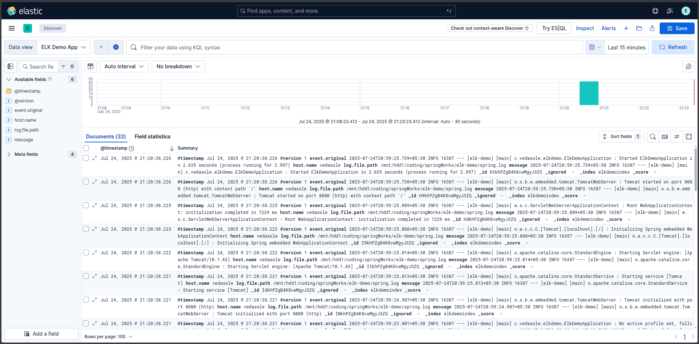
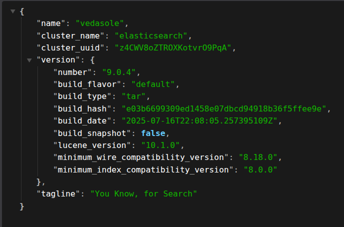

# Spring Boot + ELK Stack Demo Project

# Demo Link: 🔗
Access the site at **[localhost:8080](https://localhost:8080)**

# Table of Content: 📑

- [About The App](#about-the-app)
- [Screenshots](#screenshots)
- [Technologies](#technologies)
- [Setup](#setup)
- [Approach](#approach)
- [Status](#status)

# About the App: 📚
A demo project to test out the integration of Spring Boot with the ELK stack (Elasticsearch, Logstash, and Kibana).

# Screenshots: 📷

### 1) Kibana Logs:


# Technologies: ☕️  ⚛️

- Java
- Spring Boot
- Spring Web
- Elasticsearch
- Logstash
- Kibana

# Setup: 💻

### 1) Setting up ElasticSearch

To install and run ElasticSearch follow th given steps:

1. [Download](https://www.elastic.co/downloads/elasticsearch) and unzip Elasticsearch. <br>
Go to the `bin` directory inside the folder where you unzipped Elasticsearch.
<br><br>
2. Open Terminal and navigate to the above-mentioned directory then execute the following command.
    ```bash
   bash ./elasticsearch
   ```

3. Review the logs in terminal and Copy the following values and save them.

    `1. Password for the elastic user` <br>
    `2. Enrollment token`

    `````
    To Generate a new enrollment key
    1. Go to elasticsearch-<version>-<os>-<system-type>\elasticsearch-<version>\bin
    2. Run elasticsearch-create-enrollment-token.bat - url https://localhost:9200 -s kibana
    
    To Reset the elastic user password
    1. Go to elasticsearch-<version>-<os>-<system-type>\elasticsearch-<version>\bin
    2. Run elasticsearch-reset-password.bat -u elastic`
    `````

4. To check the status of the Elasticsearch cluster connection, hit https://localhost:9200/ on your browser and provide the Username as “elastic” and use the password you saved in step #3.

If your cluster is working properly you should get the below output.



Your app is ready to be deployed!

# Approach: 🚶
We are using a demo spring boot web application that generates logs and stores in in the local `spring.log` file. Logstash is configured to read this log file and send the logs to Elasticsearch. Kibana is used to visualize the logs stored in Elasticsearch.

# Status: 📶
Completed 🛠️ 🟩